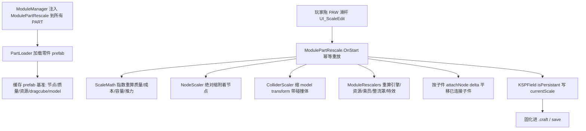

# PartRescale 设计文档（KSP1 全零件 RO 式自由放缩）

> 状态：已经用户逐节确认（2026-09-20）。
> 技术调研：见会话子代理《调研 KSP 缩放机制与现有实现》报告，本设计以其结论为依据。

## 1. 目标与范围

为 KSP1（1.12.x）的**所有原版零件**在 VAB/SPH 编辑器内提供 **RO 式自由连续放缩**：右键 PAW 中出现连续滑杆 + 数值输入，实时改变零件尺寸，属性全面联动，造好后尺寸固化进存档（.craft / save）。

### 1.1 核心约束（已确认）

- 全零件通用（不局限于油箱/结构件）。
- 自由连续缩放（非固定档位），默认范围 **0.1x – 10x**（cfg 可调）。
- 属性全面联动：模型/网格、附着节点、碰撞体、质量、成本、资源容量、引擎推力/比冲、连接强度、整流罩、乘员容量、引擎特效（含 Waterfall）。
- 仅编辑器（VAB/SPH）内可调；飞行中锁定。尺寸经 PartModule 持久化字段固化进存档。
- 模组名 **PartRescale**；架构与部署完全对齐本仓库 CrewHiring / EngineLifecycle 惯例。

### 1.2 明确不做（YAGNI）

- 不做飞行中实时缩放（物理风险）。
- 不依赖 TweakScale / ProceduralParts 等第三方；纯自研。
- 不做"对接口尺寸匹配"强校验。
- 不重新发明程序化网格重建（ProceduralParts 路线）；采用"缩放现有网格 + 幂律缩放属性"的 TweakScale 式路线。

### 1.3 调研关键结论（设计依据）

- 原版 KSP 1.12.x 无任何通用零件缩放 tweakable；`ModulePartVariants` 是离散视觉变体，非连续缩放。需自研。
- RO 的"自由放缩"主要来自 Procedural Parts（程序化重建网格）；RO 显式禁用 TweakScale。全零件通用只能走"缩放现有网格 + 幂律属性"路线。
- 自研最小可行路线 = **PartModule + ModuleManager 注入为主，Harmony 仅兜底**（第三方兼容/stock bug 补丁）。

## 2. 必须遵守的硬约束（来自调研的血泪教训）

1. **绝对重算，禁止增量累乘**：所有基准数据（attach node 位置/尺寸、drag cube、质量、成本、资源量、model localScale）首次从 `part.partInfo.partPrefab` 缓存；每次缩放都从 prefab 基准 × 系数重算。增量累乘会被 `ModulePartVariants` / B9PartSwitch 覆写节点数据搞乱。
2. **初始化放 `OnStart` 而非 `OnAwake`**，且**幂等防重入**（KSP 1.9+ 编辑器克隆 / Alt-click / 合并 craft 生命周期坑）。
3. **序列化走 PartModule 的 `[KSPField(isPersistant=true)]`**，不往 Part ConfigNode 塞私货。
4. **声明依赖 KSPCommunityFixes（KSPCF）**：它修复 1.12.x 的 attach node 持久化 stock bug（ModulePartVariantsNodePersistence）。
5. **禁止 `AppDomain.CurrentDomain.GetAssemblies()`**（本机毒程序集会抛 ExecutionEngineException）；探测第三方模块一律用 `AssemblyLoader.loadedAssemblies` 或程序集限定名 `Type.GetType`。

## 3. 排除与特例（黑名单，opt-out）

| 类别 | 处理 |
|---|---|
| 机械臂（Breaking Ground robotics） | 排除（缩放会坏） |
| KerbalEVA、小行星/彗星 | 排除 |
| 降落伞 | 特例评估 |
| 整流罩 `ModuleProceduralFairing` | 特例：缩放 `baseRadius`/`maxRadius` + 底座模型（MODEL scale 的 Y 分量保持 1），不简单缩 transform |
| root 零件 | 特殊处理或限制（stock 雷区） |
| 乘员容量 | 稳妥做法：缩小可、**放大受限**（KSP 内部多处用 prefab 的 CrewCapacity，放大会踩坑） |

黑名单做成 cfg opt-out，参照 TweakScale Rescaled 的过滤思路。

## 4. 放缩数学模型（固定幂律指数表，已确认选 a）

设缩放系数 `s = 当前尺寸 / prefab 原始尺寸`。所有属性从 prefab 基准值按指数重算：

| 属性 | 指数 | 说明 |
|---|---|---|
| 模型/网格 transform | s¹ | `rescaleFactor = prefab.rescaleFactor × s`；`model.localScale = prefab × s` |
| 附着节点 position | s¹ | 绝对重算 `node.position = prefab位置 × s` |
| 附着节点 size（等级） | 阶梯 | 按直径换算最近档位；**srfAttach 节点 size 不缩**（影响连接刚度） |
| 质量 | s² ~ s³ | 空壳件（油箱/乘员舱/整流罩）≈2，实心件（引擎/结构）≈3，按零件类别选指数 |
| 成本 | 同质量指数 | |
| 资源容量（燃料等） | s³ | 体积缩放 |
| 引擎推力 maxThrust | s² | 面积/喷口缩放 |
| 引擎比冲 Isp | 不随 s 变（RO 一致性，保持设计点） | |
| 发电量 | s² | |
| 扭矩 | s³ | |
| 连接强度 breakingForce/Torque | s² ~ s³ | 可配 |
| drag cube | Size×s, Area×s², Depth×s | 从 prefab 基准重算，避免累积误差 |

指数做成 **cfg 可配**（类 `TWEAKSCALEEXPONENTS`），默认上表值，可被整合包覆写。

## 5. 架构与文件布局

完全对齐本仓库现有插件（CrewHiring / EngineLifecycle）惯例：

```
PartRescale/
  PartRescale.csproj        net481；引用 KSP Managed（Assembly-CSharp、UnityEngine.*）+ refs/harmony/0Harmony.dll；KSPDIR 环境变量覆盖
  PartRescalePlugin.cs      [KSPAddon(Startup.Instantly)] 入口：应用 Harmony patch + 注册 GameEvents
  RescaleSettings.cs        读取 GameData/PartRescale/PartRescale.cfg（min/max/指数表/黑名单）
  RescaleModule.cs          PartModule (ModulePartRescale)：PAW 滑杆字段 + OnStart/OnLoad/OnSave/OnCopy；IPartMassModifier/IPartCostModifier
  ScaleMath.cs              纯函数：质量/成本/容量/推力等随 s 的指数公式（可单元测试，不依赖 KSP）
  NodeScaler.cs             attach node / surface node 绝对缩放
  ColliderScaler.cs         碰撞体缩放（随 model transform 自动，确保缩 model 根）
  ModuleRescalers.cs        引擎/RCS/资源/乘员/整流罩/特效 各模块属性重算
  RescalePatches.cs         Harmony patch：编辑器 PAW 刷新、第三方燃料切换器/Waterfall 兼容、stock bug 规避
PartRescale.Tests/
  ScaleMathTests.cs 等      xUnit，纯数学单测（不依赖 KSP 程序集）
GameData/PartRescale/
  PartRescale.cfg           默认设置（范围/指数表/黑名单）
  MM_InjectRescale.cfg      ModuleManager：给所有 PART 注入 MODULE[ModulePartRescale]
tools/deploy-pr.sh          部署脚本（对齐 tools/deploy-ch.sh，支持 KSPDIR）
```

### 5.1 数据流



### 5.2 ModuleManager 注入语法（要点）

```
@PART[*]:HAS[!MODULE[ModulePartRescale]]:FINAL
{
    %MODULE[ModulePartRescale] { }
}
```

- `@PART[*]` 全匹配；`:HAS[!MODULE[...]]` 防重复；`:FINAL` 最后执行（在其它 mod 加完模块后）；`%MODULE` 编辑或新建。
- 黑名单通过额外 `:HAS[~CATEGORY[...]]` / 零件名排除实现，做成可配。

## 6. PAW UI 与编辑器交互

- **控件**：PAW 加 `UI_ScaleEdit` 连续滑杆 + 数值输入（自由缩放），字段 `currentScale`，`affectSymCounterparts` 使镜像/对称件联动。
- **交互**：拖滑杆 → `OnStart` 幂等重放七步管线（transform → 节点 → 子件平移 → drag cube → 质量/成本 → 模块指数 → 资源）。
- **子件跟随**：缩放父件时按子件 attachNode 新旧位置 delta 平移子件（保持整体相对形状）；被缩件经节点连到 parent 则移自身。
- **序列化**：`currentScale` 持久化进 module ConfigNode，随 .craft/save 固化；`OnLoad`/`OnCopy` 重放。
- **范围**：默认 0.1x–10x，cfg 可调。

## 7. 依赖

- KSP 1.12.x
- ModuleManager（注入用，无需引用 dll）
- 000_Harmony（Harmony patch 用）
- KSPCommunityFixes（修复 attach node 持久化 stock bug，强烈建议声明）

## 8. 测试策略

- `ScaleMath` 等纯函数用 xUnit 单元测试（指数公式、节点缩放换算、drag cube 系数），不依赖 KSP。
- 编辑器内行为（PAW、子件跟随、序列化重放、黑名单）以脚本化部署到主安装 + 人工/脚本验证（对齐仓库既有 schtasks 托管启动流程）。

## 9. 主要技术风险

- KSP 1.9+ 编辑器生命周期坑（克隆/Alt-click/SaveUpgradePipeline 覆写缩放值）——靠"绝对重算 + OnStart 幂等 + KSPCF"缓解。
- root 零件缩放 stock 雷区 —— 特殊处理或限制。
- 乘员容量放大坑 —— 限缩不限放。
- 整流罩特例复杂 —— 单独缩放 baseRadius/maxRadius。
- drag cube 累积误差 —— 一律从 prefab 基准重算。
